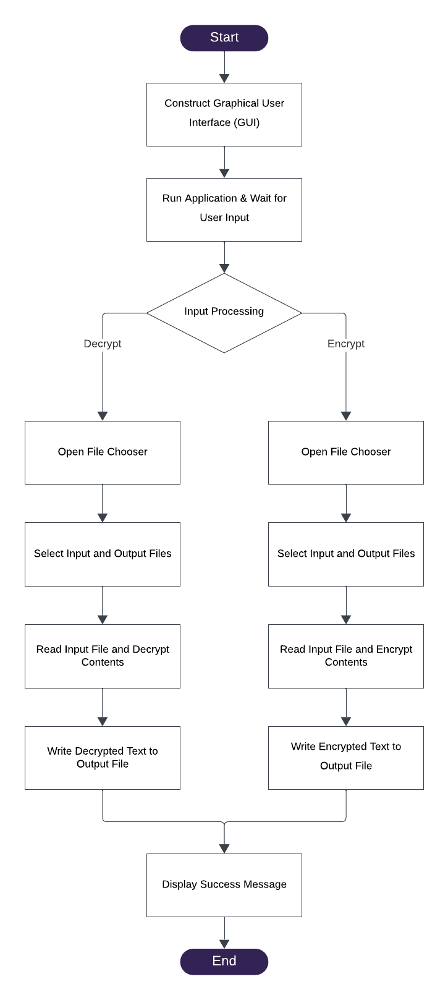
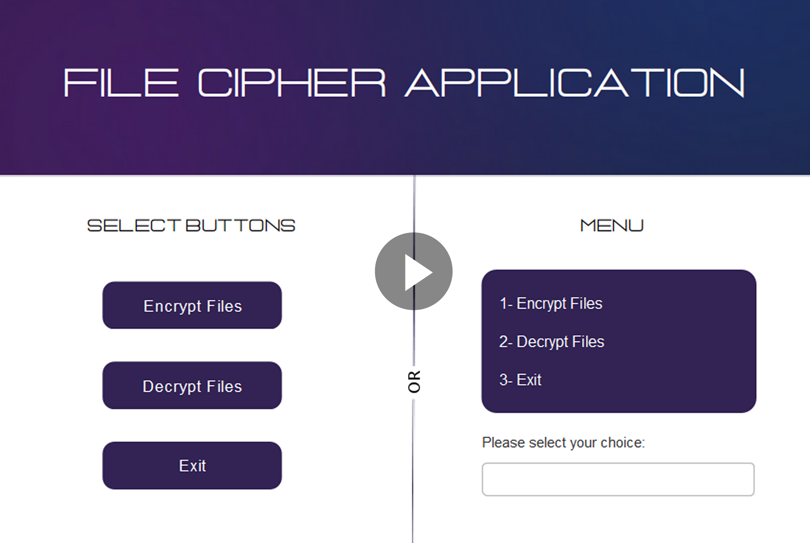

# 🔐 File Cipher Application

The File Cipher Application is a Java-based tool that enables users to encrypt and decrypt text files through a user-friendly interface, using classical cryptographic techniques to secure file contents. The program is a testament to the significance of privacy in our digitally networked society, offering a simplified yet practical demonstration of securing personal information through code. It supports both Arabic and English text, ensuring multilingual accessibility and usability.

## 📊 Flowchart

<div align="center">
  <picture>
    <source srcset="assets/flowchart_dark.png" media="(prefers-color-scheme: dark)">
    <source srcset="assets/flowchart_light.png" media="(prefers-color-scheme: light)">
    
  </picture>
</div>

## 🧠 Pseudocode

```plaintext
BEGIN PROGRAM

INITIALIZE MAIN WINDOW:
  CREATE JFRAME WITH TITLE "ENCRYPTED FILES APPLICATION"
  SET SIZE, DEFAULT CLOSE OPERATION, AND PREVENT RESIZING

SET UP USER INTERFACE:
  ADD JLAYEREDPANE TO JFRAME
  LOAD BACKGROUND IMAGE AND ADD TO PANE
  CREATE AND ADD GUI ELEMENTS (LABELS, TEXT AREA, INPUT FIELD)
  CONFIGURE ACTION LISTENER FOR INPUT FIELD

DISPLAY MAIN WINDOW
WAIT FOR USER INPUT IN INPUT FIELD

WHEN INPUT RECEIVED:
  IF INPUT IS "1" THEN CALL FUNCTION ENCRYPTFILE
  ELSE IF INPUT IS "2" THENCALL FUNCTION DECRYPTFILE
  ELSE IF INPUT IS "3" THEN
    TERMINATE PROGRAM
  ELSESHOW ERROR MESSAGE "INVALID INPUT. PLEASE ENTER 1, 2, OR 3."

FUNCTION ENCRYPTFILE:
  PROMPT USER TO CHOOSE INPUT FILE
  PROMPT USER TO CHOOSE OUTPUT FILE LOCATION
  READ INPUT FILE LINE BY LINE
  FOR EACH LINE:
    ENCRYPT LINE
    WRITE ENCRYPTED LINE TO OUTPUT FILE
  END FOR
  NOTIFY USER "FILE ENCRYPTED SUCCESSFULLY"

FUNCTION DECRYPTFILE:
  PROMPT USER TO CHOOSE INPUT FILE
  PROMPT USER TO CHOOSE OUTPUT FILE LOCATION
  READ INPUT FILE LINE BY LINE
  FOR EACH LINE:
    DECRYPT LINE
    WRITE DECRYPTED LINE TO OUTPUT FILE
  END FOR
  NOTIFY USER "FILE DECRYPTED SUCCESSFULLY"

END PROGRAM
```

## 📁 Project Structure

   ```bash
   cipher_application/
   ├── src/
   │ └── cipher_application.java
   ├── cipher.txt
   ├── decrypt.txt
   ├── message.txt
   └── README.md
   ```

## 🎬 Demo 

<a href="https://youtu.be/_wWtaNU7JS4" target="_blank">
  
</a>
